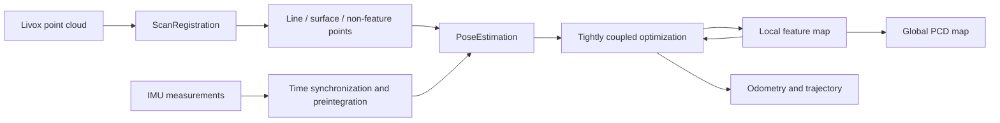
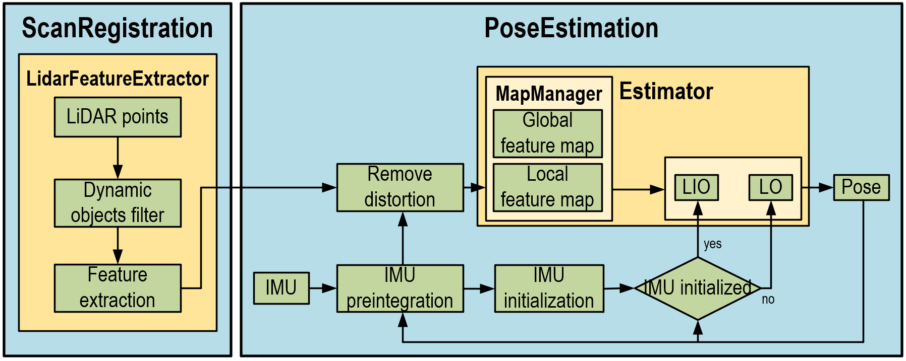

# ForgeLIO

**Robust LiDAR-inertial odometry and mapping for Livox sensors**

[](https://www.ros.org/)
[](https://isocpp.org/)
[](LICENSE)

ForgeLIO is an engineering-focused LiDAR-inertial odometry and mapping system for Livox solid-state LiDARs. It extends the original [LIO-Livox](https://github.com/Livox-SDK/LIO-Livox) architecture with HAP and Mid-360 integration, stricter LiDAR/IMU synchronization, safer numerical methods, robust residual handling, hardened segmentation, and automatic global-map export.

The ROS package name remains `lio_livox` for compatibility with existing launch files and workspaces.

> ForgeLIO is research software. Validate sensor calibration, timing, accuracy, and failure behavior before using it on a vehicle or safety-critical system.

## Highlights

- Tightly coupled LiDAR-IMU estimation with LiDAR-only and IMU-deskew-only fallback modes.
- Ready-to-use launch configurations for Livox Horizon, HAP, and Mid-360.
- HAP preprocessing without a mechanical-LiDAR range-image projection assumption.
- Ordered IMU buffering, duplicate rejection, time-offset correction, boundary interpolation, and IMU-gap detection.
- Huber loss and finite residual gating for line, plane, and non-feature constraints.
- Normalized PCA plane fitting with degeneracy and finite-value checks.
- Regularized covariance-to-square-root-information conversion instead of unsafe direct inversion.
- Stable ground-normal alignment for parallel, general, and antiparallel vector cases.
- Safer point-cloud segmentation with empty-cloud checks and reusable memory buffers.
- Binary-compressed global PCD map export during clean shutdown.
- Lightweight regression tests for critical numerical and synchronization invariants.

## System overview



The system runs two main ROS nodes:

- `ScanRegistration` validates the input cloud, optionally filters foreground clusters, and extracts geometric features.
- `PoseEstimation` synchronizes IMU data, compensates motion distortion, initializes inertial states, solves the sliding-window LiDAR-IMU problem, and updates the map in a background thread.

<p align="center">
  
</p>

## Supported sensors and messages

| Sensor | Configuration | Point-cloud input | Default IMU mode |
|---|---|---|---:|
| Livox Horizon | `config/horizon_config.yaml` | `livox_ros_driver/CustomMsg` | 2 |
| Livox HAP | `config/hap_config.yaml` | `livox_ros_driver/CustomMsg` | 2 |
| Livox Mid-360 | `config/mid360_config.yaml` | `CustomMsg`, or `sensor_msgs/PointCloud2` with `msg_type=1` | 2 |

All default launch files expect the LiDAR topic `/livox/lidar`. The default IMU topic is `/livox/imu`.

## Dependencies

- Ubuntu with ROS 1 and a catkin workspace
- CMake and a C++11 compiler
- [Eigen3](https://eigen.tuxfamily.org/)
- [PCL](https://pointclouds.org/)
- [Ceres Solver](http://ceres-solver.org/)
- [SuiteSparse](https://people.engr.tamu.edu/davis/suitesparse.html)
- [OpenCV](https://opencv.org/)
- [livox_ros_driver](https://github.com/Livox-SDK/livox_ros_driver), providing the `livox_ros_driver/CustomMsg` message used by this package

For a ROS installation whose distribution is already configured in `ROS_DISTRO`, the non-ROS dependencies can typically be installed with:

```bash
sudo apt update
sudo apt install -y \
  build-essential cmake \
  libeigen3-dev libpcl-dev libceres-dev libsuitesparse-dev libopencv-dev \
  ros-$ROS_DISTRO-pcl-ros \
  ros-$ROS_DISTRO-tf-conversions \
  ros-$ROS_DISTRO-eigen-conversions \
  ros-$ROS_DISTRO-message-filters
```

Install and verify the Livox driver before compiling ForgeLIO. The ROS package `livox_ros_driver` must be discoverable in the same workspace or in a sourced underlay.

## Build

```bash
mkdir -p ~/catkin_ws/src
cd ~/catkin_ws/src

git clone https://github.com/Livox-SDK/livox_ros_driver.git
git clone https://github.com/Shidabot/ForgeLIO.git

cd ~/catkin_ws
catkin_make -DCMAKE_BUILD_TYPE=Release
source devel/setup.bash
```

If the Livox driver is installed in a different workspace, source that workspace before running `catkin_make`.

## Run

Start the Livox driver or begin publishing a recorded bag before launching ForgeLIO. Use only the launch file matching the connected sensor.

### Horizon

```bash
roslaunch lio_livox horizon.launch
```

### HAP

HAP uses tightly coupled IMU fusion by default:

```bash
roslaunch lio_livox hap.launch
```

Override the IMU topic when necessary:

```bash
roslaunch lio_livox hap.launch imu_topic:=/your/imu/topic
```

### Mid-360

```bash
roslaunch lio_livox mid360.launch
```

The provided Mid-360 launch file uses `livox_ros_driver/CustomMsg` by default. Set the `msg_type` parameter in `launch/mid360.launch` to `1` when the LiDAR driver publishes `sensor_msgs/PointCloud2`.

### Play a rosbag

In another terminal:

```bash
cd ~/catkin_ws
source devel/setup.bash
rosbag play /absolute/path/to/your_data.bag
```

Confirm that the bag topics and message types match the inputs below before debugging the estimator:

```bash
rosbag info /absolute/path/to/your_data.bag
rostopic type /livox/lidar
rostopic hz /livox/imu
```

## ROS interface

### Inputs

| Topic | Type | Description |
|---|---|---|
| `/livox/lidar` | `livox_ros_driver/CustomMsg` or supported `sensor_msgs/PointCloud2` | Raw Livox point cloud |
| `/livox/imu` | `sensor_msgs/Imu` | IMU data; configurable in HAP launch |

### Intermediate feature topics

| Topic | Type |
|---|---|
| `/livox_full_cloud` | `sensor_msgs/PointCloud2` |
| `/livox_less_sharp_cloud` | `sensor_msgs/PointCloud2` |
| `/livox_less_flat_cloud` | `sensor_msgs/PointCloud2` |
| `/livox_nonfeature_cloud` | `sensor_msgs/PointCloud2` |

### Outputs

| Topic | Type | Description |
|---|---|---|
| `/livox_full_cloud_mapped` | `sensor_msgs/PointCloud2` | Registered point cloud in the map frame |
| `/livox_odometry_mapped` | `nav_msgs/Odometry` | Estimated LiDAR odometry |
| `/livox_odometry_path_mapped` | `nav_msgs/Path` | Accumulated trajectory |

RViz starts automatically from the supplied launch files using `rviz_cfg/lio.rviz`.

## Important launch parameters

| Parameter | Default | Description |
|---|---:|---|
| `IMU_Mode` / `imu_mode` | `2` | `0`: LiDAR only; `1`: IMU deskew only; `2`: tightly coupled LiDAR-IMU |
| `imu_topic` | `/livox/imu` | IMU topic; exposed by `hap.launch` |
| `imu_time_offset` | `0.0` s | IMU timestamp minus LiDAR timestamp. Corrected IMU time is `raw_time - offset` |
| `imu_wait_timeout_ms` | `1000` ms | Maximum wait for IMU samples bracketing a LiDAR frame |
| `max_imu_gap` | `0.1` s | Reject a frame when adjacent IMU samples exceed this interval |
| `lidar_huber_delta` | `0.1` m | Huber transition threshold for LiDAR residuals |
| `lidar_outlier_threshold` | `1.0` m | Hard correspondence residual gate in normal LIO mode |
| `filter_parameter_corner` | `0.2` m | Corner-map voxel size |
| `filter_parameter_surf` | `0.4` m | Surface-map voxel size |
| `save_map` | `true` | Save a global map during clean shutdown |
| `map_file_path` | `/tmp/lio_livox_global_map.pcd` | Absolute output PCD path |
| `save_map_leaf_size` | `0.2` m | Final global-map voxel size; use `0` to avoid final downsampling |

### IMU-LiDAR extrinsic calibration

`Extrinsic_Tlb` is a row-major 4 x 4 rigid transform stored in each sensor launch file. The supplied values are examples for the corresponding setup; they are not universal calibration values. Replace them with the calibrated transform for your sensor assembly, especially when using an external IMU.

Incorrect extrinsics or time offset usually appear as doubled walls, blurred edges, oscillating attitude, or rapidly increasing drift.

## Feature and segmentation configuration

Sensor-specific feature settings are stored in `config/*.yaml`.

| Parameter | Description |
|---|---|
| `Lidar_Type` | `0`: Horizon, `1`: HAP, `2`: Mid-360 |
| `Used_Line` | Number of Livox scan lines used by feature extraction |
| `Feature_Mode` | Enables the alternative configured feature mode |
| `DistanceFaraway` | Near/far feature threshold boundary |
| `LidarNearestDis` | Minimum accepted point range |
| `FlatThreshold` | Surface-curvature threshold |
| `KdTreeCornerOutlierDis` | Corner-neighbor rejection threshold |
| `Use_seg` | `0`: disable foreground segmentation; `1`: enable segmentation |
| `map_skip_frame` | Intended map update interval in frames |

The segmentation stage separates ground, background, and foreground clusters. Foreground rejection can improve robustness in traffic, but it may also remove useful constraints when the scene is sparse. Compare `Use_seg: 0` and `Use_seg: 1` on representative data before deployment.

<p align="center">
  
</p>

The ground-alignment derivation and implementation invariants are documented in [Ground correction derivation](doc/ground_correction_derivation.md).

## Save the global map

Map saving is enabled by default. Stop the mapping node cleanly with `Ctrl+C`. ForgeLIO drains the map-update queue and writes a binary-compressed PCD file.

```bash
roslaunch lio_livox hap.launch \
  map_file_path:=/absolute/path/global_map.pcd \
  save_map_leaf_size:=0.2
```

The parent directory must already exist and be writable. Disable export with:

```bash
roslaunch lio_livox hap.launch save_map:=false
```

Do not force-kill the node if the final map is required, because forced termination cannot run the shutdown export path.

## Tuning guidance

1. Calibrate `Extrinsic_Tlb` before changing feature thresholds.
2. Estimate `imu_time_offset` using motion-rich data and inspect deskewed edges.
3. Verify the IMU rate is stable and keep `max_imu_gap` above the normal IMU period but below an interval that would hide packet loss.
4. Increase map voxel sizes to reduce CPU and memory usage; decrease them cautiously when the environment contains fine geometric detail.
5. Reduce `lidar_outlier_threshold` in clean static scenes; increase it only when valid correspondences are being rejected.
6. Enable `Use_seg` for traffic-heavy data and disable it when foreground classification removes too much static structure.

Change one parameter group at a time and evaluate trajectory consistency, wall thickness, CPU time, and memory consumption on the same bag.

## Tests

Run the source-level regression checks with:

```bash
python3 tests/test_p0_invariants.py
```

The checks cover critical time-synchronization parameters, covariance handling, robust loss use, marginalization ownership, and launch-file consistency. They complement, rather than replace, a full ROS build and real-bag evaluation.


## Acknowledgements

ForgeLIO is derived from [Livox-SDK/LIO-Livox](https://github.com/Livox-SDK/LIO-Livox). The original copyright and BSD license notice are retained.

The upstream project also acknowledges the following work:

- [LOAM](https://github.com/cuitaixiang/LOAM_NOTED)
- [VINS-Mono](https://github.com/HKUST-Aerial-Robotics/VINS-Mono)
- [LIO-mapping](https://github.com/hyye/lio-mapping)
- [ORB-SLAM3](https://github.com/UZ-SLAMLab/ORB_SLAM3)
- [LiLi-OM](https://github.com/KIT-ISAS/lili-om)
- [MSCKF_VIO](https://github.com/KumarRobotics/msckf_vio)
- [horizon_highway_slam](https://github.com/Livox-SDK/horizon_highway_slam)
- [livox_mapping](https://github.com/Livox-SDK/livox_mapping)
- [livox_horizon_loam](https://github.com/Livox-SDK/livox_horizon_loam)

## License

ForgeLIO is distributed under the BSD 3-Clause license. See [LICENSE](LICENSE). The 2026 ForgeLIO modification notice does not remove or replace the upstream Livox copyright.


